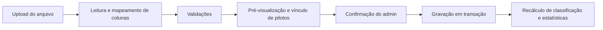
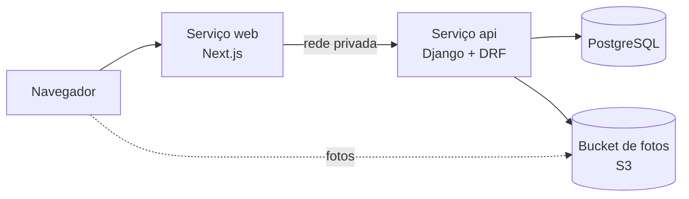
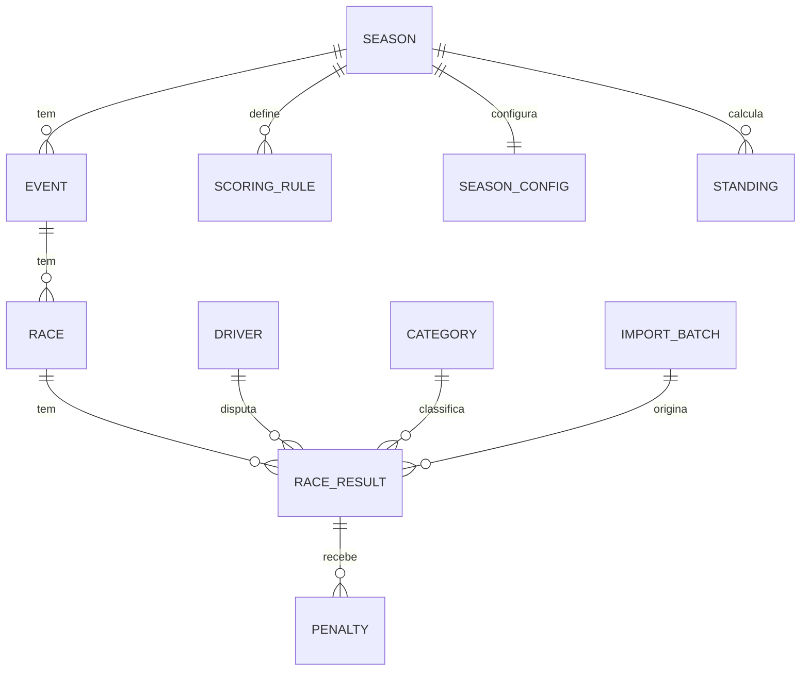

# RKR Kart Racing — Documentação Base do Sistema de Campeonato

2026-09-20 · @Someone

## Visão geral

O sistema publica a classificação do campeonato de Kart Rental RKR, mostra indicadores por categoria e detalha a trajetória de cada piloto ao longo do ano, tudo a partir de planilhas de resultados enviadas por um administrador.

**Objetivos do produto**

- Listar a classificação geral de RK1, RK2 e RK3, sem descarte de corridas.
- Oferecer um dashboard de indicadores por categoria (voltas rápidas, vitórias, consistência, penalizações e outras estatísticas de corrida).
- Abrir, ao clicar no nome de um piloto, uma janela semitransparente sobre a própria lista, com foto, estatísticas e gráfico de linha da pontuação ao longo do ano, com e sem descarte.
- Permitir que a organização alimente o sistema enviando planilhas Excel/CSV por um painel administrativo.

**Público**

- Pilotos e público em geral: acesso somente leitura, sem login, majoritariamente pelo celular.
- Administração do campeonato: acesso protegido por login, para importar resultados, cadastrar pilotos e fotos e configurar regras.

**Premissas assumidas**

- RK1, RK2 e RK3 são categorias independentes, cada uma com sua própria classificação. A categoria é guardada em cada resultado, porque um piloto pode mudar de categoria durante o ano.
- A tabela de pontos por posição será enviada pela organização; o sistema a trata como configuração, nunca como constante no código.
- Idioma pt-BR e fuso America/Sao\_Paulo.

**Fora do escopo da primeira versão**

- Inscrição de pilotos, pagamentos, cronometragem ao vivo e aplicativo nativo.

## Identidade visual e direção de design

A interface segue a estética de telemetria de Fórmula 1: fundo quase preto, dados densos, linhas finas de 1 px, vermelho como único acento e texto branco. A logo enviada (fundo preto, "RKR" branco, "R" estilizado com faixa vermelha) é a referência de cor e de forma.

**Paleta**

| Token | Valor | Uso |
| --- | --- | --- |
| `--bg` | #0A0A0B | Fundo da página |
| `--surface` | #121215 | Cartões e tabelas |
| `--line` | rgba(255,255,255,0.08) | Bordas e divisórias de 1 px |
| `--red` | #E10613 (conferir com o conta-gotas na logo) | Acento, destaques, líder, hover |
| `--red-glow` | rgba(225,6,19,0.45) | Brilho neon em sombras e gráficos |
| `--text` | #FFFFFF | Texto principal |
| `--muted` | #9A9AA3 | Rótulos, eixos, texto secundário |
| `--fastest` | #B14DFF (opcional) | Somente volta mais rápida, seguindo a convenção da F1 |

**Tipografia**

- Títulos e posições: Barlow Condensed, itálico e em caixa alta, para dar sensação de velocidade.
- Textos: Barlow Semi Condensed.
- Números, tempos e pontos: JetBrains Mono com numerais tabulares, para as colunas alinharem como em um timing screen.

**Linguagem visual**

- Grade sutil no fundo e cantos cortados na diagonal (clip-path), ecoando o ângulo do "R" da logo.
- Tabelas em estilo timing tower: posição em bloco, barra vertical vermelha no líder, variação de posição com setas.
- Brilho neon vermelho apenas em elementos ativos (hover, linha selecionada, série do gráfico).
- Números que contam de 0 até o valor ao entrar na tela; gráficos que se desenham; linhas da tabela que se reordenam com animação ao trocar de categoria.
- Respeitar `prefers-reduced-motion`: sem animação para quem desativa no sistema.

**Janela do piloto (modal)**

- Painel de vidro: fundo rgba(10,10,12,0.6), `backdrop-filter: blur(18px)`, borda de 1 px e sombra vermelha difusa; a lista de classificação continua visível e desfocada atrás.
- Foto do piloto ocupando um lado com máscara em degradê (`mask-image`) e vinheta vermelha, de modo que ela se dissolva no painel em vez de aparecer inteira.
- Número ou posição do piloto gigante em contorno fino ao fundo, como marca d'água.
- Fechar com clique fora, tecla Esc ou botão X; no celular, abre como painel deslizante de baixo para cima.

**Uso da logo**

- Cabeçalho fixo com a logo à esquerda e seletor RK1 / RK2 / RK3 à direita.
- O símbolo "R" isolado serve de favicon, ícone de carregamento e marca d'água.
- Pedir à organização a logo em SVG ou PNG com fundo transparente; o arquivo atual tem fundo preto e serve apenas como referência.

## Regras de negócio

A classificação geral soma todos os pontos conquistados na categoria, sem descarte; o descarte existe somente como visão alternativa na janela do piloto. Toda regra abaixo fica em tabelas de configuração editáveis pelo administrador, para o campeonato poder mudar de regulamento sem alterar código.

**Estrutura do campeonato**

- Uma temporada contém 3 corridas classificatórias de pré-temporada e depois divide em RK1, RK2 e RK3 para as etapas restantes; cada etapa contém uma corrida; cada corrida tem um resultado por piloto.
- Os pontos são calculados por corrida, na categoria em que o piloto correu.

**Pontuação por posição**

- Tabela própria da organização, a ser enviada, armazenada como posição → pontos.
- Campos opcionais, todos com valor padrão 0: bônus de pole, bônus de volta mais rápida e pontos de quem larga mas não termina (DNF).
- Desqualificado (DSQ) e ausente recebem 0 ponto.

**Classificação geral (sem descarte)**

```latex
P_{total} = \sum_{i=1}^{n} p_i
```

onde p\_i é a pontuação do piloto na corrida i e n é o total de corridas realizadas na categoria.

**Classificação com descarte (janela do piloto)**

```latex
P_{descarte} = \sum_{i=1}^{n} p_i \; - \; \sum_{j=1}^{k} \text{piores}_j
```

k é o número de descartes configurado no painel (padrão a definir com a organização). Só corridas em que o piloto participou entram na escolha dos piores resultados; ausência não é descartada como se fosse resultado.

**Critérios de desempate (ordem padrão, configurável)**

1. Maior número de vitórias.
2. Maior número de segundos lugares, depois terceiros, e assim por diante.
3. Melhor posição na última etapa disputada.
4. Maior número de voltas mais rápidas.

**Penalizações**

- A planilha traz a posição final oficial, já com as penalidades aplicadas; o sistema não recalcula posição.
- O sistema registra cada penalização (tipo, segundos ou posições, motivo) apenas para estatística e transparência.

## Requisitos funcionais por tela

O site público tem duas telas principais (Classificação e Dashboard) mais a janela do piloto, que é uma camada sobre a Classificação; o painel administrativo fica em rota separada e protegida.

**Tela 1 — Classificação geral** (`/`, `/rk1`, `/rk2`, `/rk3`)

- Abas RK1, RK2 e RK3 no cabeçalho; cada categoria tem URL própria, para compartilhar.
- Tabela estilo timing tower com posição, variação em relação à etapa anterior (seta e número), foto miniatura e nome do piloto, pontos totais, pontos por etapa, vitórias, pódios e diferença para o líder.
- Seletor "classificação até a etapa N", que recalcula a tabela como ela estava após aquela etapa.
- Busca por nome do piloto.
- Clicar no nome do piloto abre a janela do piloto sem sair da tela; a URL ganha `?piloto=<id>` só para permitir compartilhar e usar o botão voltar.
- No celular, o nome do piloto e a posição ficam fixos e as colunas de etapas rolam na horizontal.

**Tela 2 — Dashboard** (`/dashboard/rk1`, `/dashboard/rk2`, `/dashboard/rk3`)

- Filtro por categoria e por intervalo de etapas.
- Cartões de indicadores principais: piloto com mais voltas rápidas, mais vitórias, mais consistente e total de penalizações.
- Para cada indicador, um Top 5 com barras horizontais e o valor em fonte monoespaçada.
- Bloco de estatísticas extras (definidas na seção seguinte).
- Clicar em qualquer nome de piloto abre a mesma janela do piloto.

**Janela do piloto** (camada sobre a Classificação)

- Visual de vidro semitransparente, com foto parcialmente visível, sombreado e brilho vermelho (ver identidade visual).
- Cabeçalho: nome, categoria, posição atual, pontos totais e número de participações.
- Estatísticas: vitórias, pódios, voltas rápidas, melhor posição, posição média, penalizações e pontos por etapa.
- Gráfico de linha da pontuação acumulada ao longo das etapas, com alternância "Sem descarte" e "Com descarte". Na visão com descarte, as corridas descartadas aparecem esmaecidas no gráfico e na lista de etapas.
- Tooltip por etapa com posição, pontos e penalizações.
- Setas para navegar para o piloto anterior ou seguinte da classificação sem fechar a janela.

**Painel administrativo** (`/admin`, com login)

- Importar resultados: upload de Excel/CSV, pré-visualização com erros destacados, confirmação e histórico de importações com opção de desfazer uma importação.
- Pilotos: cadastro, categoria, apelido e envio da foto; unir cadastros duplicados.
- Etapas e corridas: data, local e situação.
- Regras: tabela de pontos, número de descartes e ordem dos critérios de desempate.
- Recalcular classificações e estatísticas manualmente, caso uma regra seja alterada.

## Estatísticas e indicadores

Os quatro indicadores pedidos são calculados por categoria ao longo do ano; os extras foram escolhidos por fazerem sentido em corrida e dependem das colunas disponíveis na planilha. Todos são calculados no servidor a partir dos resultados importados e guardados prontos para consulta.

**Indicadores obrigatórios**

| Indicador | Definição e cálculo | Desempate |
| --- | --- | --- |
| Mais voltas rápidas | Número de corridas em que o piloto fez a melhor volta da corrida na categoria | Melhor tempo absoluto |
| Mais vitórias | Número de corridas com posição final 1 | Mais segundos lugares |
| Piloto mais consistente | Percentual de corridas disputadas em que terminou entre os N primeiros (N configurável, padrão 5). Só entra no ranking quem disputou ao menos 50% das corridas | Menor posição média, depois menor desvio padrão das posições |
| Total de penalizações | Soma das ocorrências de penalização por piloto e o total da categoria; o Top 5 lista os pilotos mais penalizados e exibe também os segundos acumulados | Menos segundos acumulados |

**Estatísticas extras sugeridas**

| Indicador | O que mostra | Depende de |
| --- | --- | --- |
| Pódios | Corridas entre os 3 primeiros | Posição final |
| Posição média de chegada | Média das posições finais nas corridas disputadas | Posição final |
| Poles | Número de largadas na primeira posição | Posição de largada |
| Ganho médio de posições | Média de (posição de largada − posição de chegada); destaca quem mais ultrapassa | Posição de largada |
| Melhor volta absoluta | Menor tempo de volta da temporada, por etapa e da categoria | Tempo da melhor volta |
| Taxa de conclusão | Percentual de corridas terminadas, sem abandono ou desqualificação | Situação do resultado |
| Pontos por corrida | Pontos totais divididos pelas corridas disputadas | Pontos |
| Maior sequência | Maior série consecutiva de corridas pontuando e de pódios | Posição final |
| Evolução na tabela | Maior subida e maior queda de posição na classificação entre etapas | Classificação por etapa |
| Mapa de resultados | Grade piloto × etapa colorida pela posição final, para ver quem oscila e quem é regular | Posição final |
| Diferença para o líder | Distância em pontos do líder ao longo das etapas, para mostrar a disputa pelo título | Pontos |

Quando a planilha não trouxer uma coluna da qual um extra depende, esse cartão é ocultado automaticamente em vez de exibir zeros.

## Importação de planilhas (Excel/CSV)

O administrador envia uma planilha por etapa, o sistema valida, mostra uma pré-visualização e só grava depois da confirmação. O layout abaixo é uma proposta em formato "longo" (uma linha por piloto em cada corrida); ele deve ser ajustado à planilha real da organização, e o importador terá um mapeamento de colunas com nomes alternativos para aceitar pequenas variações.

**Colunas propostas**

| Coluna | Obrigatória | Descrição |
| --- | --- | --- |
| temporada | Sim | Ano do campeonato, por exemplo 2026 |
| etapa | Sim | Número da etapa |
| data | Sim | Data da etapa (AAAA-MM-DD ou DD/MM/AAAA) |
| local | Não | Kartódromo ou cidade |
| corrida | Sim | Identificador da corrida dentro da etapa (bateria, final) |
| categoria | Sim | RK1, RK2 ou RK3 |
| posicao | Sim | Posição final oficial, já com penalidades aplicadas |
| piloto | Sim | Nome do piloto |
| largada | Não | Posição de largada; habilita poles e ganho de posições |
| melhor\_volta | Não | Melhor volta do piloto na corrida (mm:ss.mmm); habilita voltas rápidas |
| voltas | Não | Voltas completadas |
| status | Não | FIN, DNF, DSQ ou DNS; ausente equivale a FIN |
| penalizacoes | Não | Quantidade de penalizações na corrida |
| penalizacao\_segundos | Não | Segundos acumulados de penalização |
| motivo\_penalizacao | Não | Texto livre |

Os pontos não precisam vir na planilha: o sistema os calcula pela tabela de pontuação. Se houver uma coluna `pontos`, ela é usada só para conferência e o sistema avisa quando houver divergência.

**Exemplo fictício de CSV**

```csv
temporada,etapa,data,corrida,categoria,posicao,piloto,largada,melhor_volta,status,penalizacoes
2026,1,2026-03-14,Final,RK1,1,Piloto A,2,00:41.235,FIN,0
2026,1,2026-03-14,Final,RK1,2,Piloto B,1,00:41.410,FIN,1
2026,1,2026-03-14,Final,RK1,3,Piloto C,3,00:41.298,FIN,0
```

**Fluxo de importação**



O fluxo lê o arquivo, valida, deixa o administrador resolver pendências e só então grava e recalcula.

**Validações**

- Categoria válida e posições sem repetição dentro de cada corrida e categoria.
- Tempos no formato mm:ss.mmm e datas válidas.
- Piloto não cadastrado: o sistema sugere o cadastro mais parecido (ignorando acentos, maiúsculas e espaços) e deixa o administrador vincular a um piloto existente ou criar um novo, para evitar duplicatas.
- Reenvio da mesma etapa não duplica dados: a chave é temporada + etapa + corrida + categoria; o sistema mostra o que será substituído e pede confirmação.
- Toda importação fica registrada (arquivo, autor, data, linhas gravadas) e pode ser desfeita.
- Erros são listados por linha e coluna; nada é gravado enquanto houver erro bloqueante.

## Stack tecnológica

A recomendação é um frontend em Next.js/React, para chegar no visual de telemetria com animações e gráficos ricos, e um backend em Python/Django com PostgreSQL, que resolve bem leitura de planilhas, regras de negócio e painel administrativo. Tudo roda na Railway.

| Camada | Tecnologia | Por que |
| --- | --- | --- |
| Frontend | Next.js (App Router) + React + TypeScript | Renderização no servidor com revalidação, páginas rápidas e URLs compartilháveis por categoria e piloto |
| Estilo | Tailwind CSS com tokens de design (variáveis CSS) | Paleta e efeitos de vidro, brilho e diagonais centralizados em um único lugar |
| Componentes acessíveis | Radix UI (Dialog, Tabs, Toggle, Tooltip) | Modal do piloto com foco, tecla Esc e leitores de tela resolvidos, estilizado livremente |
| Animações | Motion (Framer Motion) | Reordenação animada da tabela, entrada da janela do piloto, contadores |
| Gráficos | Apache ECharts | Gráfico de linha com brilho neon, degradês, marcação de pontos descartados e mapas de calor |
| Tabela | TanStack Table | Ordenação, colunas fixas e virtualização, se necessário |
| Backend | Python 3.12+, Django e Django REST Framework | ORM, migrações, autenticação e admin prontos; API REST tipada |
| Importação | pandas + openpyxl | Leitura de .xlsx e .csv, normalização e validação em lote |
| Imagens | Pillow | Recorte e conversão das fotos dos pilotos para WebP em tamanhos fixos |
| Banco de dados | PostgreSQL | Consultas agregadas para classificação e estatísticas |
| Armazenamento de fotos | Bucket compatível com S3 (django-storages) | Fotos fora do disco do contêiner; alternativa: volume da Railway |
| Servidor | Gunicorn + WhiteNoise | Servir a API e arquivos estáticos do Django |
| Testes | pytest (regras), Vitest e Playwright (interface) | As regras de pontuação, desempate e descarte são o coração do sistema e precisam de testes |
| Qualidade | Ruff, ESLint, Prettier, GitHub Actions | Padronização e verificação automática a cada push |

**Decisões que valem registrar**

- Os cálculos de classificação, descarte e estatísticas ficam no backend, em módulo próprio e sem dependência de framework, para serem testados isoladamente.
- O frontend nunca recalcula regra de negócio: apenas exibe o que a API devolve.
- Sem Redis na primeira versão. Como os dados mudam poucas vezes por mês, os resultados calculados são gravados no banco no momento da importação, e a revalidação do Next.js cuida do cache das páginas.

## Arquitetura e hospedagem na Railway

O sistema roda como um projeto Railway com três serviços (web, api e banco) mais um bucket para fotos, todos em um repositório único no GitHub com deploy automático a cada push na branch principal.



O navegador conversa apenas com o serviço web; o web encaminha as chamadas de API para o Django pela rede privada da Railway, e as fotos são servidas direto do bucket.

**Serviços**

| Serviço | Origem | Configuração |
| --- | --- | --- |
| web | Pasta `apps/web` do repositório | Domínio público, healthcheck em `/`, build e start do Next.js |
| api | Pasta `apps/api` do repositório | Sem domínio público, ou com domínio restrito ao admin; comando de pré-deploy `python manage.py migrate`; healthcheck em `/api/health/` |
| Postgres | Plugin de PostgreSQL da Railway | Backups habilitados; variável `DATABASE_URL` referenciada pelo serviço api |
| Bucket | Bucket S3 compatível | Leitura pública das fotos; escrita apenas pelo serviço api |

**Variáveis de ambiente**

| Serviço | Variável | Finalidade |
| --- | --- | --- |
| web | `API_INTERNAL_URL` | Endereço interno do serviço api (`*.railway.internal`) |
| web | `NEXT_PUBLIC_SITE_URL` | URL pública do site |
| web | `REVALIDATE_SECRET` | Segredo que autoriza a API a renovar o cache das páginas |
| api | `DATABASE_URL` | Referência ao Postgres do projeto |
| api | `DJANGO_SECRET_KEY` | Chave secreta do Django |
| api | `DJANGO_ALLOWED_HOSTS` e `CSRF_TRUSTED_ORIGINS` | Domínios autorizados |
| api | `S3_BUCKET`, `S3_ENDPOINT`, `S3_ACCESS_KEY`, `S3_SECRET_KEY` | Acesso ao bucket de fotos |
| api | `WEB_REVALIDATE_URL` e `REVALIDATE_SECRET` | Aviso ao web depois de cada importação |

**Decisões de arquitetura**

- Mesma origem: o Next.js usa rewrites para repassar `/api/*` ao Django, o que evita CORS e permite login de administrador por cookie de sessão sem problemas de domínio cruzado.
- Cache: as páginas públicas são renderizadas com revalidação; ao fim de uma importação, a API chama o endpoint de revalidação do web para o site refletir os novos resultados na hora.
- Ambientes: `production` e `staging` no mesmo projeto Railway, com o staging usado para testar importações antes de valer.
- Segredos ficam apenas em variáveis da Railway, nunca no repositório.
- Antes de contratar, confirmar no plano da Railway o limite de memória, o backup do banco e o recurso de bucket, pois variam por plano.

## Modelo de dados

O resultado de um piloto em uma corrida (`RaceResult`) é o dado central; classificação, estatísticas e gráficos derivam dele.



Uma temporada tem etapas, cada etapa tem corridas e cada corrida tem resultados por piloto e categoria; penalizações, regras e importações se ligam a esses resultados.

**Entidades e campos principais**

| Entidade | Campos principais | Observações |
| --- | --- | --- |
| Season | ano | Uma por campeonato anual |
| Category | código (RK1, RK2, RK3), nome, ordem de exibição | Fixas, criadas por carga inicial |
| Driver | nome, apelido, slug, foto, ativo | Nome normalizado (sem acento, minúsculas) para achar duplicatas |
| Event | temporada, número, data, local | Uma etapa do calendário |
| Race | etapa, ordem, rótulo (bateria, final) | Pode haver uma ou mais por etapa |
| RaceResult | corrida, categoria, piloto, posição, largada, melhor volta (ms), voltas, status, pontos, indicador de volta mais rápida, importação de origem | Único por corrida + categoria + piloto |
| Penalty | resultado, tipo (tempo, posição, desclassificação), segundos, posições, motivo | Alimenta o indicador de penalizações |
| ScoringRule | temporada, posição, pontos | Tabela própria da organização |
| SeasonConfig | temporada, número de descartes, N do Top N de consistência, ordem de desempate, bônus | Editável no painel |
| ImportBatch | arquivo, autor, data, situação, linhas | Permite auditar e desfazer importações |
| Standing | temporada, categoria, etapa de corte, piloto, posição, pontos sem descarte, pontos com descarte | Recalculado a cada importação; alimenta "classificação até a etapa N" e a variação de posição |

**Regras de integridade e desempenho**

- Tempos de volta guardados como inteiros em milissegundos, formatados só na exibição.
- Índices em (categoria, piloto), (corrida, categoria, posição) e em Standing por (temporada, categoria, etapa).
- Os pontos de cada resultado são gravados na importação e recalculados quando a tabela de pontuação mudar.
- Desfazer uma importação apaga ou marca como inativos os resultados daquele lote e dispara novo recálculo.
- Fotos: o banco guarda só o caminho no bucket; o Pillow gera versões em tamanhos fixos (miniatura para a tabela e versão grande para a janela).

## API

A API é REST em JSON, com prefixo `/api`. Os endpoints públicos são somente leitura; os administrativos exigem sessão autenticada e token CSRF. O parâmetro `season` assume a temporada mais recente quando omitido.

**Endpoints públicos**

| Método e rota | Parâmetros | Retorno |
| --- | --- | --- |
| GET `/api/categories/` | — | RK1, RK2 e RK3 com ordem de exibição |
| GET `/api/events/` | `season` | Etapas com data, local e corridas |
| GET `/api/standings/` | `category`, `season`, `upto` (etapa de corte) | Classificação sem descarte: posição, variação, pontos totais, pontos por etapa, vitórias, pódios, diferença para o líder |
| GET `/api/dashboard/` | `category`, `season`, `from`, `to` | Os quatro indicadores obrigatórios com Top 5 e as estatísticas extras disponíveis |
| GET `/api/drivers/{slug}/` | `category`, `season` | Foto, estatísticas e as séries do gráfico, sem e com descarte |
| GET `/api/health/` | — | Verificação de saúde para a Railway |

**Endpoints administrativos**

| Método e rota | Função |
| --- | --- |
| POST `/api/admin/login/` e `/api/admin/logout/` | Sessão do administrador |
| POST `/api/admin/imports/preview/` | Envia o arquivo (multipart) e devolve erros, pendências de pilotos e resumo do que será gravado |
| POST `/api/admin/imports/{id}/confirm/` | Grava a importação, recalcula e avisa o web para renovar o cache |
| POST `/api/admin/imports/{id}/undo/` | Desfaz uma importação |
| GET `/api/admin/imports/` | Histórico de importações |
| GET, POST, PATCH `/api/admin/drivers/` | Lista e edita pilotos; POST `/api/admin/drivers/{id}/photo/` envia a foto |
| GET, PUT `/api/admin/rules/` | Tabela de pontos, descartes, Top N e desempates |
| POST `/api/admin/recalculate/` | Recalcula classificações e estatísticas de uma temporada |

**Exemplo de resposta do perfil do piloto**

```json
{
  "driver": { "slug": "piloto-a", "name": "Piloto A", "photo": "https://.../piloto-a-lg.webp" },
  "category": "RK1",
  "rank": 2,
  "stats": { "points": 187, "wins": 2, "podiums": 5, "fastest_laps": 3, "avg_position": 3.4, "penalties": 1 },
  "series": {
    "labels": ["Etapa 1", "Etapa 2", "Etapa 3"],
    "no_discard": [25, 61, 87],
    "with_discard": [25, 61, 87],
    "discarded_races": []
  }
}
```

Os números do exemplo são fictícios e servem apenas para mostrar o formato. Em `with_discard`, `discarded_races` lista as corridas descartadas para o frontend esmaecê-las no gráfico.

## Requisitos não funcionais

O uso será majoritariamente no celular, em picos logo após cada etapa, por isso velocidade e leitura em tela pequena pesam tanto quanto o visual.

| Área | Requisito |
| --- | --- |
| Desempenho | Maior renderização de conteúdo (LCP) abaixo de 2,5 s em 4G; resposta da API abaixo de 300 ms nas rotas públicas; janela do piloto abre em menos de 200 ms com dados já em cache |
| Responsividade | Layout pensado primeiro para celular (360 px) e adaptado para tablet e desktop; tabela com colunas fixas e rolagem horizontal; janela do piloto como painel deslizante no celular |
| Acessibilidade | Contraste mínimo AA (texto branco sobre fundo escuro cumpre); navegação completa por teclado; foco visível em vermelho; modal com foco preso e tecla Esc; textos alternativos nas fotos; respeito a `prefers-reduced-motion` |
| Segurança | HTTPS obrigatório; login do administrador com senha forte e limite de tentativas; cookies de sessão `HttpOnly` e `Secure`; proteção CSRF; validação de tipo e tamanho dos arquivos (planilhas até 5 MB, fotos até 5 MB, apenas JPG, PNG e WebP); segredos só em variáveis de ambiente |
| Privacidade | Exibir apenas nome, foto e resultados esportivos; fotos e nomes de pilotos publicados com autorização da organização, com opção de ocultar um piloto |
| Confiabilidade | Backups automáticos do Postgres; importações em transação (tudo ou nada); histórico para desfazer; healthcheck monitorado |
| Observabilidade | Logs estruturados no Railway; captura de erros (por exemplo Sentry); métricas básicas de acesso |
| SEO e compartilhamento | Metadados e imagem de pré-visualização (Open Graph) por categoria e por piloto, para o link ficar bonito no WhatsApp |
| Manutenção | Regras de negócio com cobertura de testes; migrações versionadas; documentação de deploy no repositório |

**Estrutura sugerida do repositório**

```text
rkr/
├─ apps/
│  ├─ web/            # Next.js (frontend)
│  │  ├─ app/         # rotas: /, /[categoria], /dashboard/[categoria]
│  │  ├─ components/  # tabela, modal do piloto, gráficos, cartões
│  │  └─ styles/      # tokens de design
│  └─ api/            # Django + DRF
│     ├─ championship/  # models, serializers, views
│     ├─ rules/         # pontuação, descarte, desempate (Python puro)
│     ├─ imports/       # leitura e validação de planilhas
│     └─ tests/
├─ docs/              # esta documentação e exemplos de planilha
└─ .github/workflows/ # CI
```

## Roadmap, critérios de aceite e pendências

O desenvolvimento cabe em seis fases, cada uma terminando em algo que já pode ser visto e testado no ambiente de staging.

| Fase | Entrega | Critério de aceite |
| --- | --- | --- |
| 1. Fundação | Repositório, projeto Railway com staging e produção, Postgres, CI, tokens de design, cabeçalho com logo e seletor de categoria | Deploy automático funcionando e página inicial no tema escuro com a logo |
| 2. Regras e dados | Modelos, módulo de regras (pontuação, descarte, desempate) com testes, importador com pré-visualização e cadastro de pilotos e fotos | Uma planilha real é importada e os pontos batem com o cálculo manual da organização |
| 3. Classificação | Endpoint e tela de classificação por categoria, sem descarte, com seletor de etapa e variação de posição | Classificação de RK1, RK2 e RK3 confere com a oficial |
| 4. Janela do piloto | Modal de vidro com foto mascarada, estatísticas e gráfico de linha com alternância sem e com descarte | Abre sem sair da lista; o gráfico troca de série sem recarregar; funciona no celular |
| 5. Dashboard | Quatro indicadores obrigatórios com Top 5 e estatísticas extras disponíveis | Números conferem com contagem manual de uma categoria |
| 6. Polimento e lançamento | Animações, acessibilidade, desempenho, imagens de pré-visualização, domínio próprio, backups e treinamento do administrador | LCP abaixo de 2,5 s no celular, auditoria de acessibilidade sem falhas críticas e restauração de backup testada |

**Pendências para fechar com a organização**

- [ ] Enviar a tabela de pontos por posição (e bônus, se houver).
- [ ] Enviar a planilha real de uma etapa, para ajustar o layout de importação.
- [ ] Confirmar se cada etapa tem uma ou mais corridas e se os pontos são por corrida.
- [ ] Definir o número de corridas descartadas na visão com descarte.
- [ ] Confirmar os critérios de desempate e o N do Top N de consistência (padrão proposto: 5).
- [ ] Informar se a planilha traz posição de largada, melhor volta, situação e penalizações, pois isso define quais estatísticas extras aparecem.
- [ ] Confirmar como tratar piloto que troca de categoria durante o ano (proposta: classificações separadas por categoria).
- [ ] Enviar a logo em SVG ou PNG transparente e as fotos dos pilotos, com autorização de uso.
- [ ] Definir domínio do site e quantas pessoas terão acesso administrativo.
